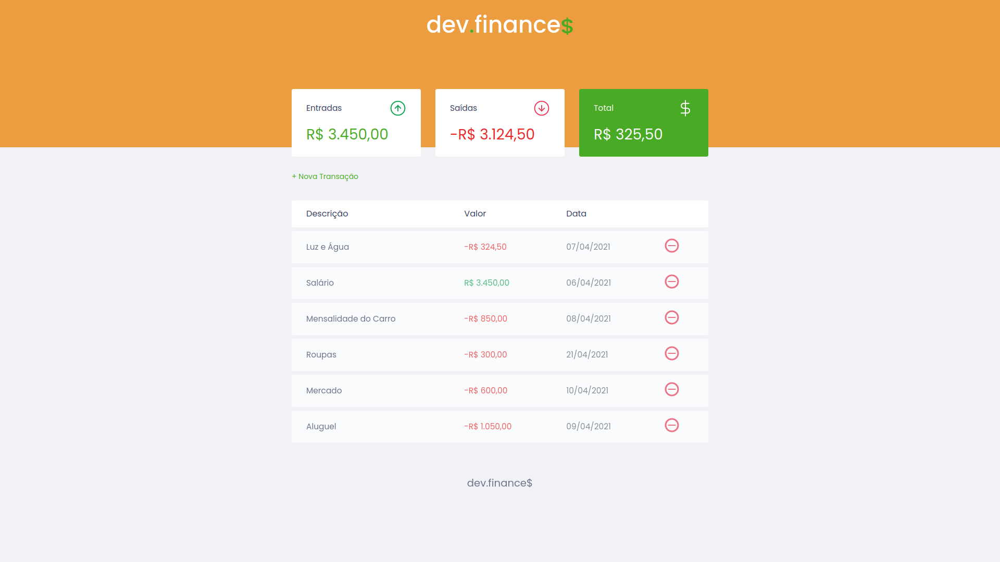
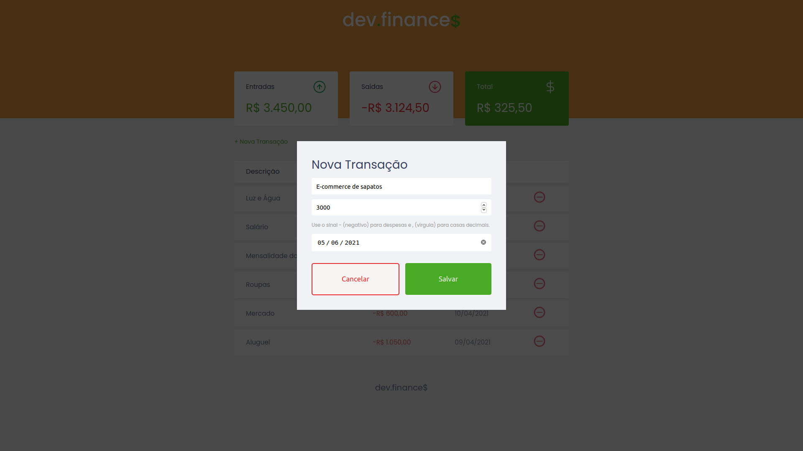
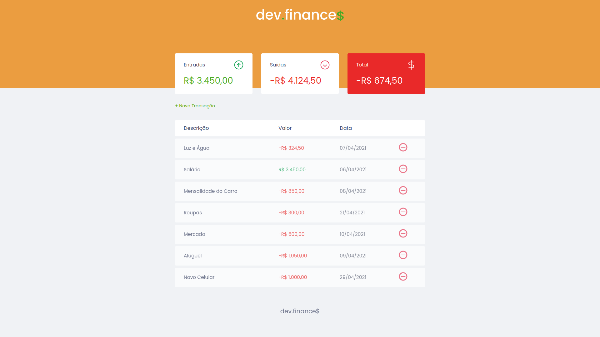

# Dev Finance
> A simple project that allows you to keep your expenses and income up to date.

Just insert a new transaction, informing if it is an entry or expense. The calculation is done automatically by the system itself.

## 🎥 Demo
<div align="center">
     
</div>
<div align="center">
     
</div>
<div align="center">
     
</div>

## 🚀 Technologies
* ✔️ HTML
* ✔️ CSS 
* ✔️ JavaScript

## ℹ️ How To Use
### 1. Getting Started
To modify (locally) this project, you will need [Node](https://nodejs.org/pt-br/download/) and npm (it's comes installed with Node) or [Yarn](https://classic.yarnpkg.com/en/docs/install/#debian-stable) installed on your computer (Yarn was utilized in this project).

### 2. Clonning And Running The Project

```sh
# Clone this repository
$ git clone https://github.com/vitormrts/discover-rocketseat

# Go to the repository cloned
$ cd discover-rocketseat

# Go to Dev Finance folder
$ cd dev-finance

# Install npx
yarn add npx -g

# Run the app in
npx http-server
```

Done! Now you can open this application.