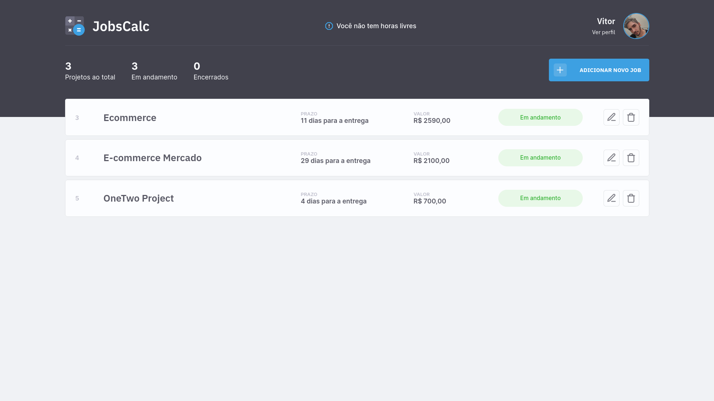
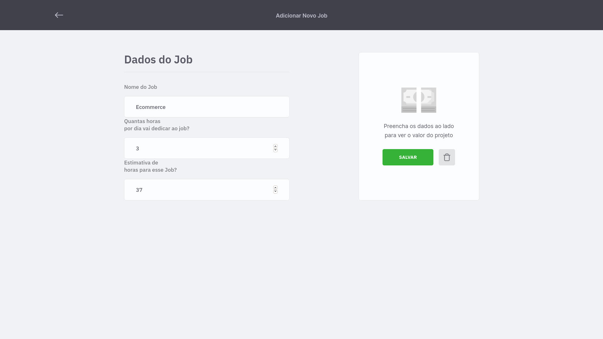
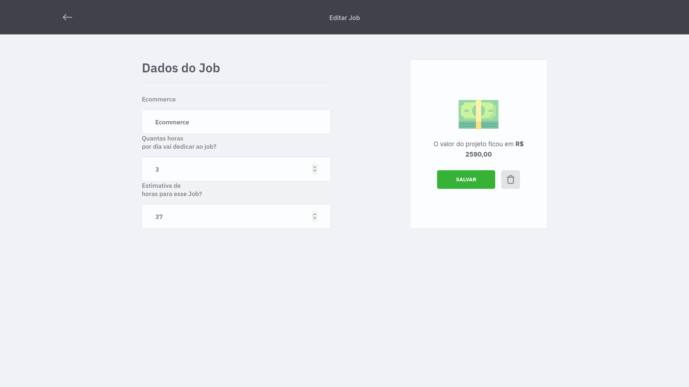
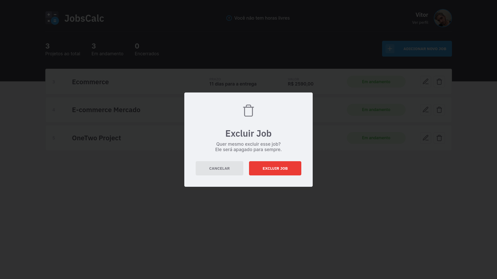

# JobsCalc
> A simple project that calculates your labor price.

Calculate the hourly rate of your work based on the following topics:
- Desired Salary;
- Number of hours desired to work in one day;
- Total weekdays dedicated to work;
- Holidays in weeks

## 🎥 Demo
<div align="center">
     
</div>

<div align="center">
     
</div>

<div align="center">
     
</div>

<div align="center">
     
</div>

<div align="center">
     
</div>

## 🚀 Technologies
* ✔️ HTML
* ✔️ CSS 
* ✔️ JavaScript
* ✔️ SQLite
* ✔️ EJS (a template for JavaScript)

## ℹ️ How To Use
### 1. Getting Started
To modify (locally) this project, you will need [Node](https://nodejs.org/pt-br/download/) and npm (it's comes installed with Node) or [Yarn](https://classic.yarnpkg.com/en/docs/install/#debian-stable) installed on your computer (Yarn was utilized in this project).

### 2. Cloning And Runnig The Project

```sh
# Clone this repository
$ git clone https://github.com/vitormrts/discover-rocketseat

# Go to the repository cloned
$ cd discover-rocketseat

# Go to JobsCalc folder
$ cd jobs-calc

# Install the dependencies
$ yarn

# Run the database
$ yarn init-db

# Run the app
$ yarn dev
```

Done! Now you have the application in your machine.
